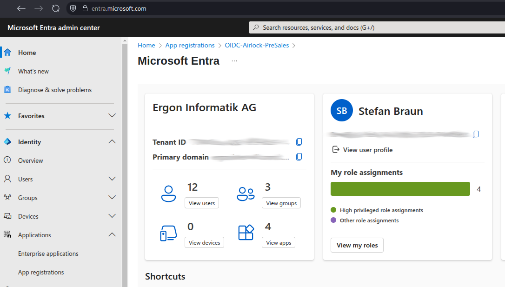
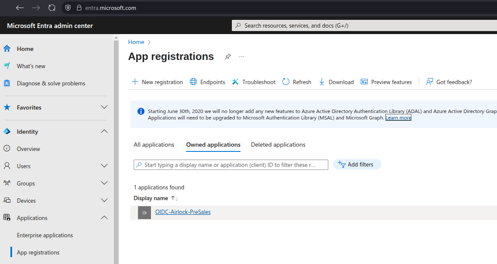
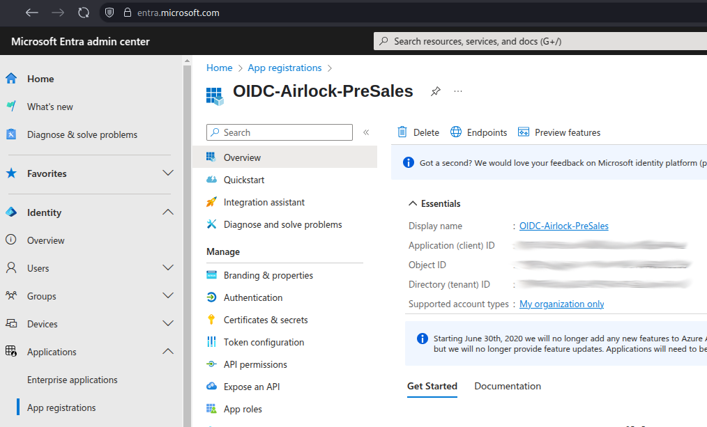
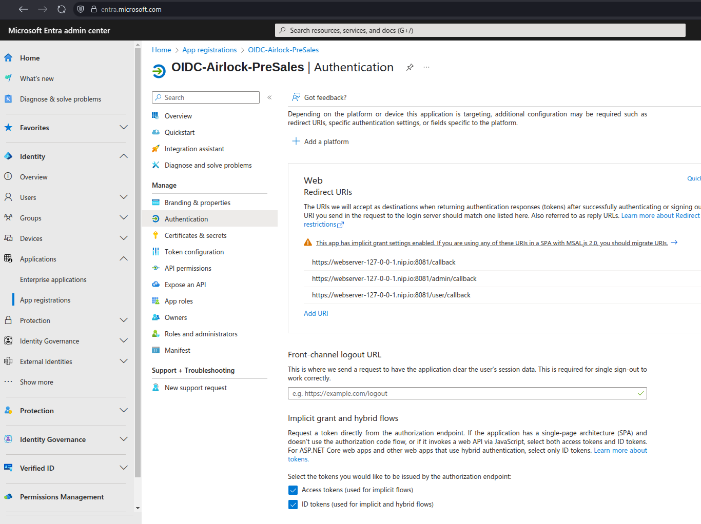
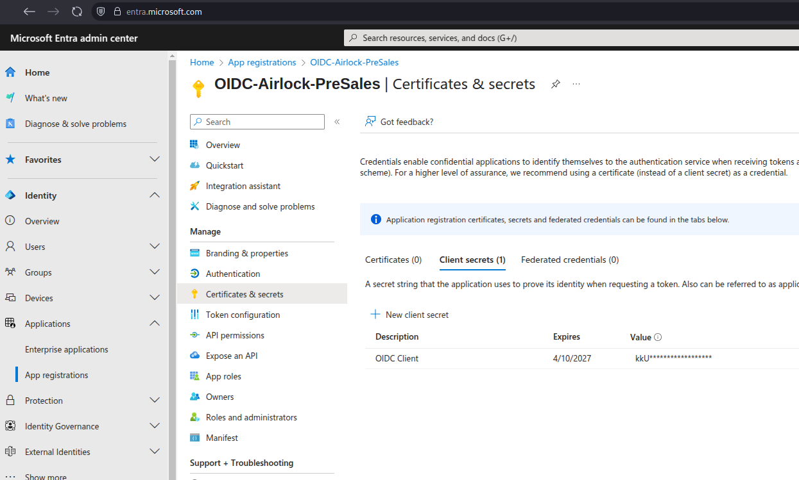
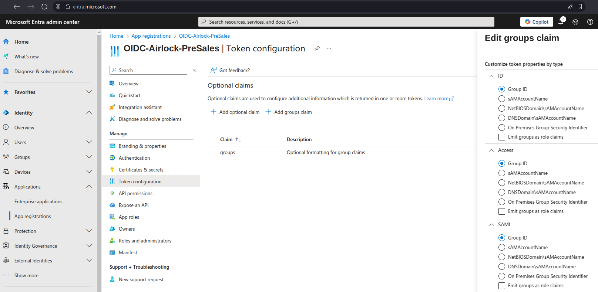

# 🔐 Airlock Microgateway OIDC Example

<p align="left">
  
</p>

Extend your secure deployment by integrating **authentication and authorization** via **OIDC (OpenID Connect)**.

---

## 🖼 Architecture Overview


**Flow Summary:**

- Requests routed through **Microgateway as ingress (GatewayAPI)**
- Services protected with **Airlock Microgateway** in mode: **as ingress** (⚠️ not Ingress API)
- Observability stack (Prometheus, Grafana, Alloy and Loki)
- Authentication via **Microsoft Entra ID (formerly known as Azure AD)**

---

## 🌐 Access the Apps

| Path | Description |
|------|-------------|
| `/` | Public |
| `/user` | User role required (group assigned to user account in Azure Entra ID tenant) |
| `/admin` | Admin role required (group assigned to user account in Azure Entra ID tenant) |

- Webserver Base URL: https://webserver-127-0-0-1.nip.io:8081/

---

## ⚙️ Setup

> [!WARNING]
> Be aware that this is an example and some security settings are disabled to make this demo as simple as possible (e.g. authentication enforcement, restrictive deny rule configuration and other security settings).

## 🧰 General Prerequisites

Before continuing, make sure your environment is prepared by following the instructions in the [General Setup](../general).  
This includes installing required tools, deploying observability components, certificate authorities, Redis, and the Airlock Microgateway itself.

## Entra ID Prerequisites

To run this example, make sure your Entra application is properly configured with the required data:

---

### **Required IDs and Secrets**

- **Group IDs:**  
   To find the Group IDs, navigate to **Entra Admin Center** → **Groups** → **All groups** and note the **Object ID** for each relevant group:

   - **User Group ID** (e.g., for regular users)
   - **Admin Group ID** (e.g., for administrators)

- **Tenant ID:**  
   Located on the **Home** page of the **Entra Admin Center**.
- **Client ID:**  
   Navigate to **Entra Admin Center** → **Applications** → **App registrations** → **Overview** → **Application (client) ID**.
- **Client Secret:**  
   Navigate to **Entra Admin Center** → **Applications** → **App registrations** → **Certificates & Secrets** → **Client Secrets** → **New client secret**.  
   **⚠️ Note:** The secret value is only visible immediately after creation.
- **Token and Redirect URI Configuration:**  
   Ensure the application is configured to send groups as part of the token and that the correct redirect URIs are set.

---

### **Configuration Visual Guide**

To assist you, here are the key steps in image form. Click the thumbnails for a larger view:

<table>
  <tr>
    <td align="center">
      <a href="media/01.png" target="_blank">
        
      </a>
      <br>
      Tenant ID
    </td>
    <td align="center">
      <a href="media/02.png" target="_blank">
        
      </a>
      <br>
      App Registration
    </td>
    <td align="center">
      <a href="media/03.png" target="_blank">
        
      </a>
      <br>
      Application (client) ID
    </td>
  </tr>
  <tr>
    <td align="center">
      <a href="media/04.png" target="_blank">
        
      </a>
      <br>
      Redirect URIs
    </td>
    <td align="center">
      <a href="media/05.png" target="_blank">
        
      </a>
      <br>
      Client Secret
    </td>
    <td align="center">
      <a href="media/06.png" target="_blank">
        
      </a>
      <br>
      Token Configuration
    </td>
  </tr>
</table>

---

## 🛠 Deployment Steps

> [!WARNING]
> Be aware that this is an example and some security settings are disabled to make this demo as simple as possible (e.g. authentication enforcement, restrictive deny rule configuration and other security settings).

## Deploy Webserver

```bash {"cwd":"../"}
kubectl kustomize --enable-helm manifests/webserver | kubectl apply --server-side -f -

# Wait until Webserver is up and running
kubectl -n oidc rollout status deployment webserver
```

## Protect Webserver (data plane mode 'sidecarless')

```bash {"cwd":"../"}
# Deploy the Airlock Microgateway configuration
kubectl kustomize --enable-helm manifests/webserver-microgateway-config | kubectl apply --server-side -f -
```

> [!WARNING]
> If Airlock Microgateway was already deployed and you switched the Gateway API standard to *experimental* (which is required for this example), you may encounter an "error 500".
> To resolve this:
>
> 1. Delete the Microgateway operator pods. They will restart automatically with the new *experimental* Gateway API CRDs.
> 2. Then, delete and reapply the `BackendTLSPolicy` manually.

```bash
kubectl -n airlock-microgateway-system delete $(kubectl get pods -n airlock-microgateway-system -o name | grep airlock-microgateway-operator-)

kubectl delete -n oidc backendtlspolicies.gateway.networking.k8s.io webserver-tls && kubectl apply -f manifests/webserver-microgateway-config/backendtlspolicy.yaml
```

## Adding Entra Data to Your Deployment

Integrating Entra data into your deployment is a crucial step to ensure your application is properly configured for authentication and authorization.

⚠️ **Important Note:**
The provided `kubectl` commands are optimized for **Linux** environments. If you are using **macOS** or **Windows**, you may need to adjust the commands accordingly.

To get the logout button working, you have to replace line 74 in in the apache-html.yaml manually with the correct tenant ID

```yaml
          const tenantId = "<TENANT_ID>"; // e.g. 11111111-2222-3333-4444-555555555555
```

For convenience, a helper script is provided at [`scripts/patch-oidc-config.sh`](scripts/patch-oidc-config.sh). Set the required environment variables and run the script to apply all patches at once (this does not work for the logout button):
To get the logout button working, you have to replace line 74 in in the apache-html.yaml manually with the correct tenant ID

```yaml
          const tenantId = "<TENANT_ID>"; // e.g. 11111111-2222-3333-4444-555555555555
```

For convenience, a helper script is provided at [`scripts/patch-oidc-config.sh`](scripts/patch-oidc-config.sh). Set the required environment variables and run the script to apply all patches at once (this does not work for the logout button):

```bash
TENANT_ID=<tenant> \
USER_GROUP_ID=<user group> \
ADMIN_GROUP_ID=<admin group> \
CLIENT_ID=<client id> \
CLIENT_SECRET=<secret> \
./scripts/patch-oidc-config.sh
```

<details>
<summary>Patch manually:</summary>

```bash
# Patch of the user group
kubectl patch AccessControlPolicy.microgateway.airlock.com webserver \
  -n oidc \
  --type='json' \
  -p='[
    {
      "op": "replace",
      "path": "/spec/policies/0/authorization/requireAll/0/oidc/claim/value/matcher/contains",
      "value": "<enter object id of the user group here>"
    },
    {
      "op": "replace",
      "path": "/spec/policies/1/authorization/requireAll/0/oidc/claim/value/matcher/contains",
      "value": "<enter object id of the admin group here>"
    }
  ]'

```

```bash
# Patch of the admin group
kubectl patch AccessControlPolicy webserver \
  -n oidc \
  --type='json' \
  -p='[
    {
      "op": "replace",
      "path": "/spec/policies/1/authorization/requireAll/0/oidc/claim/value/matcher/contains",
      "value": "<enter object id of the admin group here>"
    }
  ]'
```

```bash
# Patch of the Tenant ID for JWKS
kubectl patch JWKS webserver \
  -n oidc \
  --type='json' \
  -p='[
    {
      "op": "replace",
      "path": "/spec/provider/remote/uri",
      "value": "https://login.microsoftonline.com/<enter your tenant id here>/discovery/v2.0/keys"
    }
  ]'
```

```bash
# Patch of the client secret
# Secret has to be in base64 encoded format
# echo -n "<enter the client secret (value) here>" | base64
kubectl patch secret oidc-client-password \
  -n oidc \
  --type='json' \
  -p='[
    {
      "op": "replace",
      "path": "/stringData/client.secret",
      "value": "<enter the client secret (value) base64 encoded here>"
    }
  ]'
```

```bash
# Patch of the issuer URI
kubectl patch OIDCProvider webserver \
  -n oidc \
  --type='json' \
  -p='[
    {
      "op": "replace",
      "path": "/spec/static/issuer",
      "value": "https://login.microsoftonline.com/<enter your tenant id here>/v2.0"
    },
    {
      "op": "replace",
      "path": "/spec/static/endpoints/authorization/uri",
      "value": "https://login.microsoftonline.com/<enter your tenant id here>/oauth2/v2.0/authorize"
    },
    {
      "op": "replace",
      "path": "/spec/static/endpoints/token/uri",
      "value": "https://login.microsoftonline.com/<enter your tenant id here>/oauth2/v2.0/token"
    }
  ]'
```

```bash
# Patch for webserver-admin
kubectl patch OIDCRelyingParty webserver-admin \
  -n oidc \
  --type='json' \
  -p='[
    {
      "op": "replace",
      "path": "/spec/clientID",
      "value": "<enter your Application (client) ID here>"
    }
  ]'

# Patch for webserver-user
kubectl patch OIDCRelyingParty webserver-user \
  -n oidc \
  --type='json' \
  -p='[
    {
      "op": "replace",
      "path": "/spec/clientID",
      "value": "<enter your Application (client) ID here>"
    }
  ]'
```

</details>

## Authentication with browser

Sidecarless Base URL: https://webserver-127-0-0-1.nip.io:8081/

| Path   | Usage                                                                  |
|--------|------------------------------------------------------------------------|
| /      | Unauthenticated access possible                                        |
| /admin | Authentication required                                                |
| /user  | Authentication required                                                |

## ⚠️ Important Notes

- The limit of Groups in an OIDC token is limited to 200 by Microsoft.
- In larger organisations this limit can easily be exceeded.
- To avoid running into issues due to this limit, an Entra ID administrator should assign the registered OIDC application only the relevant group memberships (recommended for larger enterprises)

---

## 📚 Resources

* [Microgateway manual](https://docs.airlock.com/microgateway/latest/)

   * [Getting Started](https://docs.airlock.com/microgateway/latest/#data/1660804708742.html)
   * [System Architecture](https://docs.airlock.com/microgateway/latest/#data/1660804709650.html)
   * [Installation](https://docs.airlock.com/microgateway/latest/#data/1660804708713.html)
   * [Troubleshooting](https://docs.airlock.com/microgateway/latest/#data/1659430054787.html)
   * [API Reference](https://docs.airlock.com/microgateway/latest/index/api/crds/index.html)

* [Release Repository](https://github.com/airlock/microgateway)
* [Airlock Microgateway labs](https://airlock.instruqt.com/pages/airlock-microgateway-labs)

## ⚖️ License

View the [detailed license terms](https://www.airlock.com/en/airlock-license) for the software contained in this image.

* Decompiling or reverse engineering is not permitted.
* Using any of the deny rules or parts of these filter patterns outside of the image is not permitted.

</details>
<br>

Airlock<sup>&#174;</sup> is a security innovation by [ergon](https://www.ergon.ch/en)

<!-- Airlock SAH Logo (different image for light/dark mode) -->

<a href="https://www.airlock.com/en/secure-access-hub/">
<picture>
    <source media="(prefers-color-scheme: dark)"
        srcset="https://raw.githubusercontent.com/airlock/microgateway/main/media/Airlock_Logo_Negative.png">
    <source media="(prefers-color-scheme: light)"
        srcset="https://raw.githubusercontent.com/airlock/microgateway/main/media/Airlock_Logo.png">
    
</picture>
</a>
